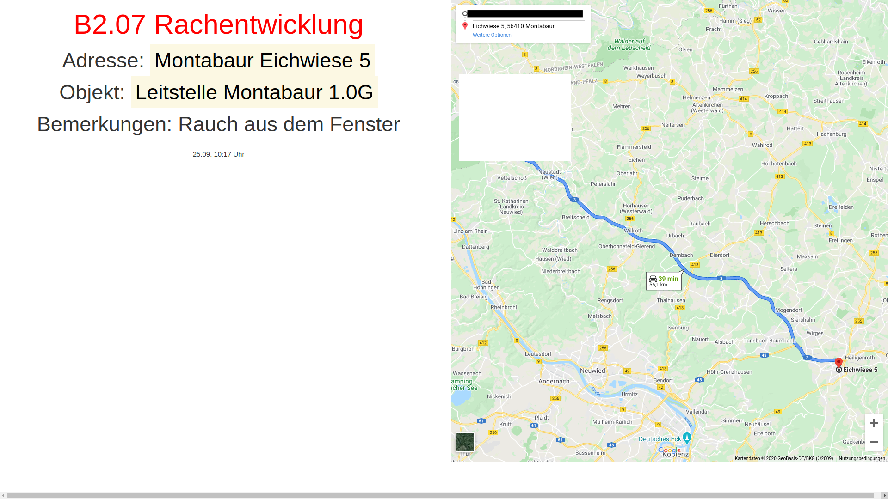

# Alarm display

* Build an alarm display based on raspberry pi
* Receive SMS from "Leitstelle" and display it on a screen

## Example alarm display screenshot

## Setup

* You can run one master alarm display as standalone or you add additional slave alarm displays
* In our case we use one master display in "Fahrzeughalle" and one slave display in "Umkleide"

## Hardware

* raspberry pi
* sd card
* power supply
* monitor (hdmi interface)
* usb modem (I'm using xxx) (only for master)

## Software

* Raspberry Pi OS with desktop as base image

## How does it work?

* SMS is received from "Leitstelle" in group alarm format cubos://ga 21.07.*05:51*B2.07*Rachentwicklung*Motabaur (WW)*Eichwiese*5*Leitstelle Montabaur*1.0G*Rach aus dem Fenster
  * Meldebild (max. 20 char) | Rauchentwicklung
  * Ortsteil (chars not limited) | Motabaur (WW)
  * Straße (chars not limited) | Eichwiese
  * Hausnummer (chars not limited) | 5
  * Objekt (chars not limited) | Leitstelle Montabaur
  * Einsatzort Bemerkung (max. 30 chars) | 1.OG
  * Einsatzanlass Bemerkung | Rauch aus dem Fenster
* SMS is written into database
* SMS is displayed on screen

## additional infos

* master needs mobile signal (mobile coverage needed)
* mobile number of SIM inserted into master display has to be registered at "Leitstelle"
* master & slave need network connectivity (LAN) between each other (name resolution has to work)
* For the map feature
  * master & slave needs internet connectiviy
  * google api key enabled for geocode & maps embed api is needed (you can get it for free, you just need a google account)
  * note: only address, nothing else is send to google. If you like you can use as source address an address near your fire department. Not directly your fire department. So that at least google cannot see directly that for all your queries a fire department is set as source address.

## Installation

* just download pi os with desktop, copy it to your sd card and enable ssh
* run playbook
  * alarm_display_master.yml to deploy a master alarm display and
  * alarm_display_slave.yml to deploy a slave alarm display
* check the variables in the playbooks in advandce, to set your specific parameter
